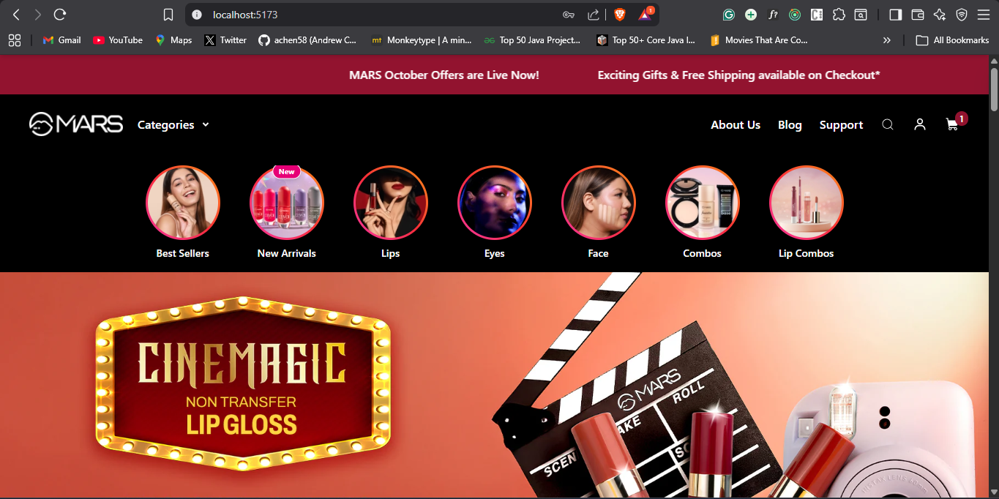
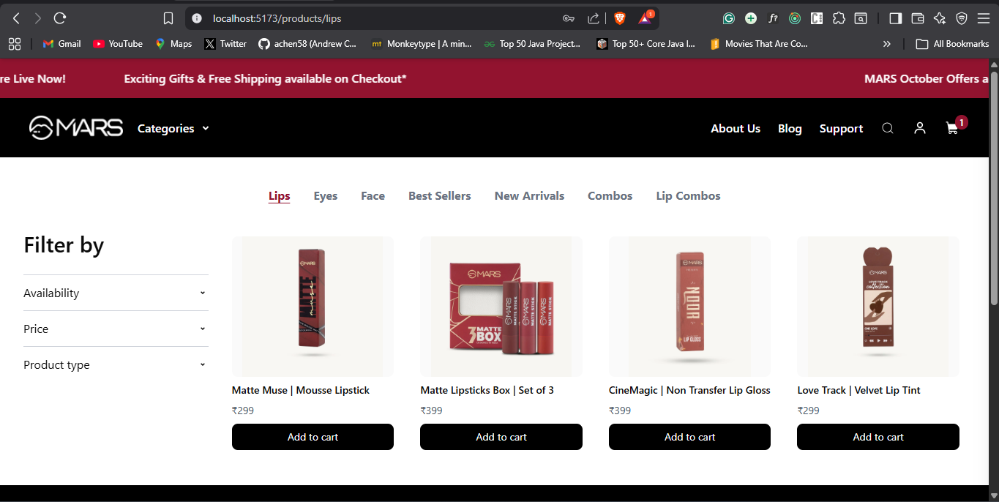
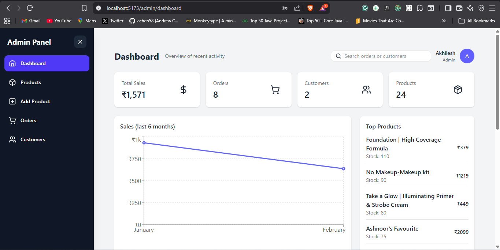

# 🛍️ Mars Cosmetics – Frontend (MERN E-Commerce)

Frontend for **Mars Cosmetics**, a full-stack e-commerce platform with a user-facing storefront and a secure admin dashboard.  
Built with **React (Vite)** and **Tailwind CSS**, consuming real backend APIs for products, orders, users, and sales analytics.

---

🔗 **Backend Repository:**  
https://github.com/Akhilkhatri10/mars-cosmetics-backend

🌐 **Live Demo:**  
https://mars-cosmetics-frontend.vercel.app

---

## 🖼️ Screenshots

These screenshots showcase both **User** and **Admin** experiences.

### User Interface
- Home page
- Product listing
- Product details
- Cart & checkout

### Admin Dashboard
- Sales analytics (monthly)
- Orders management
- Products management





---

## 🚀 Features

### User Features
- Browse products
- Search & filter
- Add to cart
- Checkout flow
- User authentication
- Responsive UI (mobile → desktop)

### Admin Features
- Sales analytics (monthly revenue charts)
- Manage products
- Manage orders
- View customers
- Admin-only protected routes

---

## 🧑‍💻 Tech Stack

- React (Vite)
- Tailwind CSS
- React Router
- Axios
- Recharts
- Lucide Icons

---

## ⚙️ Environment Variables

Create a `.env` file in the frontend root:

```env
VITE_API_URL=https://mars-cosmetics-backend.onrender.com/api
```

⚠️ **Do not commit `.env` files.**  
Use `.env.example` for reference.
--- 

## 🛠️ Local Development

### Clone the repository
```bash
git clone https://github.com/Akhilkhatri10/mars-cosmetics-frontend
```
   
### Navigate to the project directory
```bash
cd mars-cosmetics-frontend
```

### Install dependencies
```bash
npm install
```

### Start the development server
```bash
npm run dev
```

### Open your browser and go to  
```text
http://localhost:5173
```
---

## 📊 Sales Analytics (Frontend Responsibility)

- Charts are rendered using Recharts

- Backend sends pre-aggregated monthly sales data

- Frontend focuses only on visualization, not calculation

---

## 🌍 Deployment

### Frontend (Vercel)

- Connected to GitHub repository

- Environment variables configured in Vercel dashboard

- Auto-deploy on every push to main

---

## 🔒 Best Practices Followed

- No secrets committed to GitHub

- API base URL via environment variables

- Clean component structure

- Responsive layouts

- Graceful loading & empty states

---

## 📌 Future Improvements

- Sales comparison (MoM / YoY)

- Dark mode

- Admin role permissions

- Better chart tooltips

- Performance optimizations
---

## 👤 Author

**Akhilesh Khatri**  
MERN Stack / Frontend Developer  

- #### LinkedIn: [linkedin.com/in/akhilesh-khatri-78696b209](https://www.linkedin.com/in/akhilesh-khatri-78696b209)

---
## ⭐️ Show Some Love
#### If you find this project helpful, please consider giving it a ⭐️ on GitHub!
#### Your support is greatly appreciated!
#### Thank you! 😊

---

#### Thank you for checking out the Mars Cosmetics Frontend repository!
#### Happy coding! 🚀
